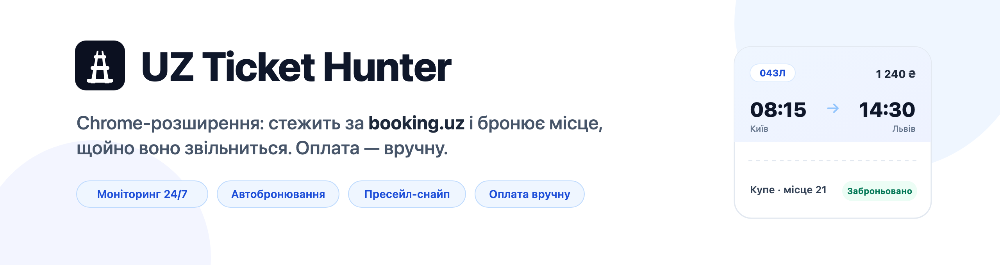
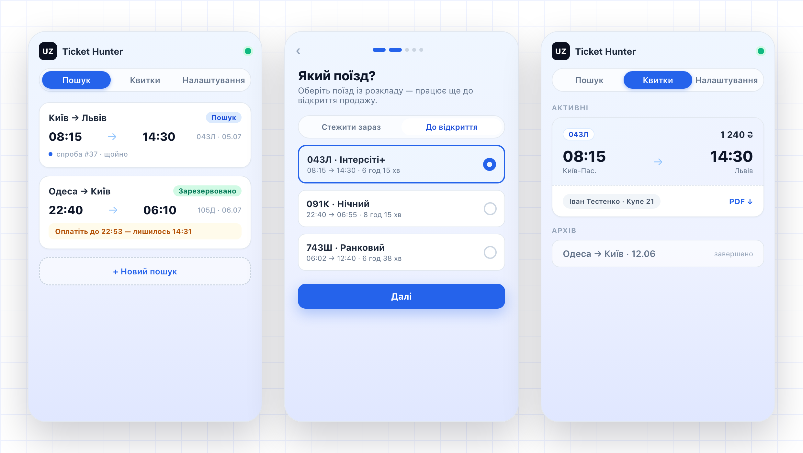

<div align="center">



&nbsp;


[](https://send.monobank.ua/jar/8daDL7FGDe)

</div>

Розширення для Google Chrome (Manifest V3), яке **автоматично відстежує та бронює** квитки на
потяги Укрзалізниці на сайті [booking.uz.gov.ua](https://booking.uz.gov.ua/). Ви задаєте
маршрут, дату й потрібні місця — далі воно саме стежить за наявністю, миттєво бронює перше
підходяще й сповіщає вас, щоб ви **завершили оплату вручну** протягом ~15 хвилин, поки
тримається бронь. Зручно для завантажених напрямків і для старту продажу квитків за 45 діб.

Зроблено на [WXT](https://wxt.dev) + React + TypeScript.

> ⚠️ **Застереження — лише для особистого використання.** Це неофіційний незалежний
> інструмент, створений, щоб допомогти одній людині купувати квитки для власних поїздок. Він
> **жодним чином не пов'язаний з Укрзалізницею**, не схвалений і не підтримується нею. Він не
> зберігає дані картки, не оплачує автоматично й не намагається обійти reCAPTCHA (її розв'язує
> людина у вкладці). Поважайте Умови користування Укрзалізниці й не використовуйте розширення
> для перепродажу чи з надмірною частотою запитів — інтервали опитування навмисно обмежені.
> Надається «як є», без жодних гарантій — **використовуєте на власний ризик**.

## Знімки екрана



> Інтерфейс українською; типи вагонів позначені як в УЗ (Л/К/П/С1/С2). Усі дані на знімках вигадані.

## Встановлення

**Зі збірки-релізу — без програмування:**

1. Завантажте останній `ukrzaliznytsia-ticket-hunter_<версія>.zip` зі сторінки
   [Releases](https://github.com/llllewvvaa/ukrzaliznytsia-ticket-hunter/releases) і розпакуйте.
2. Відкрийте `chrome://extensions` та увімкніть **Режим розробника** (Developer mode, вгорі праворуч).
3. Натисніть **Завантажити розпаковане** (Load unpacked) і виберіть розпаковану теку.

Chrome покаже повідомлення про режим розробника — це нормально для збірки поза Web Store.

**З вихідного коду:**

```bash
pnpm install
pnpm build          # → .output/chrome-mv3  (завантажте цю теку як розпаковану)
pnpm zip            # → .output/ukrzaliznytsia-ticket-hunter_<версія>.zip
```

## Як це працює (гібридна архітектура)

- **Моніторинг** — service worker напряму звертається до API `https://app.uz.gov.ua/api`
  (лише читання, швидко).
- **Бронювання** — виконується в **content-скрипті на вкладці booking.uz**, щоб повторно
  використати reCAPTCHA-токен і авторизацію живого SPA.
- **Авторизація** — content-скрипт зчитує зі сторінки Bearer-токен + `x-session-id` + id
  користувача й кешує їх у `chrome.storage.session`.
- **Origin** — правило `declarativeNetRequest` переписує заголовки `Origin`/`Referer`
  (заборонені заголовки, які `fetch` не може задати сам) на власних запитах service worker до
  `app.uz.gov.ua`, щоб вони виглядали як від SPA. Правило обмежене хостом API та
  `tabIds:[-1]` (лише SW) і **не** чіпає вкладку booking.uz та не обходить reCAPTCHA.

Перелік знайдених ендпоінтів і те, що ще лишилось з'ясувати, — у
[`docs/endpoints.md`](docs/endpoints.md). Приклади відповідей API — у [`fixtures/`](fixtures).

## Структура проєкту

```
src/
  entrypoints/
    background.ts        # service worker: оркестратор + диспетчеризація бронювання + запити
    content.ts           # booking.uz: зчитувач авторизації + виконавець бронювання (RPC)
    offscreen/           # прихована сторінка, що програє звук сповіщення
    popup/               # основний UI: список завдань + форма нового полювання + деталі
    options/             # повноекранна версія того самого UI керування
  components/            # спільний React UI
    ui.tsx               #   локальні Tailwind-примітиви (Button/Input/Chip/Toggle/…)
    JobCard.tsx NewJobForm.tsx JobDetails.tsx StationCombobox.tsx
    PassengerPicker.tsx AuthIndicator.tsx EmptyState.tsx OrdersView.tsx
  lib/
    models.ts            # доменні типи
    store.ts             # CRUD над chrome.storage.local + реактивна підписка
    auth.ts uz-api.ts    # кеш сесії + типізований клієнт UZ API
    net-rules.ts         # DNR-правило: переписати Origin/Referer для запитів SW
    bridge.ts            # RPC SW↔content-скрипт + keep-alive порт
    tab-manager.ts       # відкрити/сфокусувати вкладку booking.uz
    scheduler.ts         # тайминг alarm + backoff на 429 (чисті функції)
    orchestrator.ts      # цикл полювання: збіг → бронювання → диспетч
    reserve.ts           # внутрішньосторінкове бронювання (місця → hold → order → cart)
    cart-poller.ts       # опитування черги кошика (з урахуванням retry_in)
    reserve-dispatch.ts  # зв'язка SW: RPC вкладки → результат → success/captcha/backoff
    success.ts           # сповіщення + звук + вкладка оплати
    recaptcha.ts         # виявлення reCAPTCHA (без авторозв'язання)
    messages.ts          # контракти повідомлень сторінка↔SW + запити
    job-factory.ts       # форма → валідація HuntJob
    use-store.ts job-format.ts order-format.ts logger.ts
  assets/tailwind.css
public/sounds/alert.wav  # звук успіху
public/icon/             # іконки розширення та сповіщень
fixtures/                # анонімізовані JSON-приклади (лише для тестів)
docs/endpoints.md        # нотатки з дослідження API
```

## Вимоги

- Node.js ≥ 20 (розроблялось на v24)
- pnpm ≥ 9 (розроблялось на v10)

## Початок роботи

```bash
pnpm install        # встановлює залежності й запускає `wxt prepare`
pnpm dev            # dev-збірка з HMR (Chrome)
```

`pnpm dev` запускає dev-сервер WXT і пише розпаковане розширення в `.output/chrome-mv3`.

### Завантаження в Chrome (режим розробника)

1. Відкрийте `chrome://extensions`.
2. Увімкніть **Режим розробника** (вгорі праворуч).
3. Натисніть **Завантажити розпаковане** і виберіть `.output/chrome-mv3`.
4. Увійдіть на [booking.uz.gov.ua](https://booking.uz.gov.ua/), щоб розширення могло зчитати
   вашу сесію, а тоді відкрийте попап і створіть полювання.

> `pnpm dev` тримає збірку актуальною; після змін просто перезавантажте розширення (чи
> сторінку). Для продакшн-збірки використовуйте `pnpm build` (і `pnpm zip`, щоб запакувати).

### Як користуватися

1. **Нове полювання** — відкрийте попап і натисніть *Нове полювання* (усе відбувається в
   попапі; сторінка Опцій пропонує той самий процес на повний екран). Виберіть станції
   звідки/куди, дату, за бажанням улюблені потяги й типи вагонів (`Л/К/П/С1/С2`), пасажирів і
   послугу `постільна білизна`.
2. **Режим**:
   - **Моніторинг** — опитує кожні 5–30 с у фоні.
   - **За розкладом** — чекає без навантаження до точного часу старту, тоді робить спринт
     (200–500 мс) — ідеально для відкриття продажу о 09:00 за 45 діб. Тримайте попап
     відкритим, щоб worker не заснув під час спринту.
   - **Нативний** — зарезервовано для серверного монітора УЗ; вимкнено, доки цей ендпоінт не
     підтверджено.
3. Коли знайдено збіг, розширення бронює його у вашій вкладці booking.uz. Якщо з'являється
   reCAPTCHA, вкладку виводять на передній план — **розв'яжіть її**, і полювання продовжиться
   автоматично.
4. При успіху ви отримаєте гучне сповіщення + вкладку оплати; **завершіть оплату протягом
   ~15-хвилинної броні.** На картці й у деталях показано **«Заброньовано на HH:MM»** — точний
   час, коли місця звільняться. Керуйте полюваннями (статус, спроби, логи) з попапа/Опцій.
5. **Мої квитки** — друга вкладка попапа показує ваші замовлення в УЗ: активні/майбутні
   (`GET /api/v4/orders-with-routes`) і сторінковий архів (`GET /api/v2/orders/archived?page=`),
   з місцем, ціною та PDF-посиланнями по кожному квитку.

> Деякі запити (пошук станцій/потягів, збережені пасажири) звертаються до живих ендпоінтів;
> якщо ви не ввійшли або ендпоінт ще не підтверджено, форма переходить на ручне введення id.

## Команди

| Команда | Що робить |
|---|---|
| `pnpm dev` | Dev-збірка + HMR для Chrome |
| `pnpm build` | Продакшн-збірка → `.output/chrome-mv3` |
| `pnpm zip` | Запакувати продакшн-збірку |
| `pnpm compile` | `wxt prepare` + `tsc --noEmit` (перевірка типів) |
| `pnpm test` | Юніт-тести (Vitest + WXT `fakeBrowser`) |
| `pnpm test:watch` | Vitest у режимі спостереження |

## Внесок

Див. [`CONTRIBUTING.md`](CONTRIBUTING.md). Коротко: `pnpm compile` (суворий `tsc`) і
`pnpm test` — єдині перевірки; ніколи не комітьте `.har`-файли, знімки сторінок чи реальні
персональні дані. Архітектура й домовленості — у [`AGENTS.md`](AGENTS.md).

## Безпека

Повідомляйте про вразливості приватно — див. [`SECURITY.md`](SECURITY.md). Не прикріпляйте
захоплені дані сесії чи HAR-файли до issue.

## Ліцензія

[MIT](LICENSE) © Учасники UZ Ticket Hunter.
